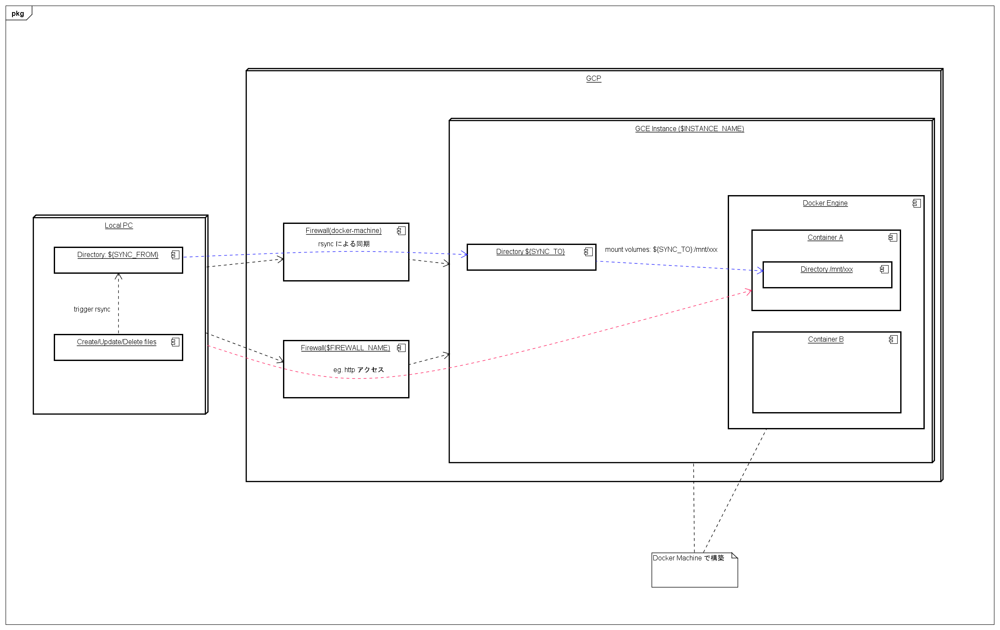

# What is remote_builer

アプリケーションのビルドやメディアファイルのエンコード等、ローカルPCでは時間のかかるタスクを、クラウド上のマシンに丸投げし、短時間で完了させることを目的とするコマンドラインツールです。

プリエンプティブインスタンスを使うことで、通常の約5分の1の価格で任意のスペックのマシンを利用することができます。例えば、2018年10月現在で us-central1 で n1-standard-4 (CPU: 4 core, Memory: 15GB) を使うと、通常の1時間あたりの金額は $0.19 に対して、プリエンプティブインスタンスの場合は $0.04 で済みます。1日12時間の使用を20日続けた場合でも、1000円程度（$1=110円換算）で収まる計算になります。

（プリエンプティブインスタンスの特徴ですが、）インスタンスの起動後に最大で24時間経過すると自動的に停止するため、作業終了後にうっかり停止を忘れても課金額が大きな額になることはありません。

# Overview

remote_builder は作業用のリモートマシンを簡単に構築することができ、ローカルで編集したファイルをリアルタイムに同期します。



# Features

- Google Cloud Platform の GCE インスタンス上に docker-machine を構築
  - ファイアウォールの自動設定
- ローカルで変更のあったファイルを自動的に同期
- インスタンス構築、起動、ファイル転送をトリガーとした任意の処理差し込み

# Pre-requisites

- Google Account
- 下記の権限を持っている GCP Project
  - GCE Instance の参照・作成
  - ファイアウォールの参照・作成
- commands
  - gcloud (Google Cloud SDK)
  - docker-machine
  - watchmedo
  - bash ( >= 4.0)
  - rsync ( >= 3.0)

# Install

```
git clone git@github.com:tomoemon/remote_builder.git

echo "PATH=$(cd remote_builder/bin; pwd):\$PATH">>~/.bashrc
```


# Usage

1. `template_config` 内のテンプレート設定ファイルをコピーして設定ファイルを作成

```
cp remote_builder/template_config/dev_appserver.sh config.sh
# edit config.sh
```
    
2. コマンドを実行

```
rstart config.sh
```

# Lifecycle

1. `rstart` コマンド実行
2. gcloud アカウントをアクティベート
3. （ファイアウォールが必要でかつファイアウォールが存在しない場合）
    1. ファイアウォールを作成
4. （インスタンスがない場合）
    1. インスタンスを作成
    2. `on_create` 実行
5. インスタンスを起動
    1. `IP_ADDRESS={インスタンスのIPアドレス}`
6. `$SYNC_FROM` から `$SYNC_TO` に対してファイルをすべて転送
7. `on_start` 実行
8. ファイル同期ループ開始
    1. （ファイル変更を検知時）
        1. ファイル転送 
        2. `/tmp/sync_log.txt` に転送したファイル一覧を出力
        3. `on_sync` 実行
